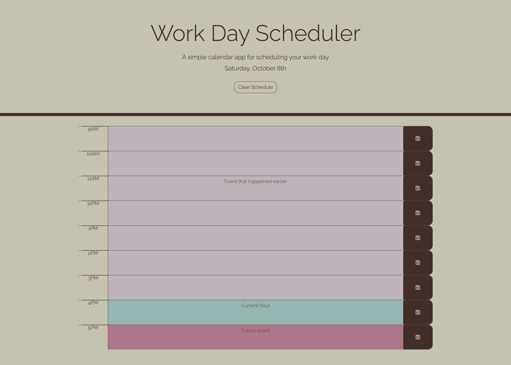

# Work-Day-Scheduler

## Description
The Work Day Scheduler is a simple calendar application where users are able to save events for each hour of the workday. This application features dynamically updated HTML and CSS powered by jQuery.

## Table of Contents

- [Installation](#installation)
- [Usage](#usage)
- [License](#license)
- [Credits](#credits)
- [Refrences](#refrences)

## Installation
Upload index.html and assets folder to the deployed webserver. The assets folder contains CSS and js files as well as images.

The linked deployed website was deployed using GitHub pages.

## Usage
The application can be viewed with the below links:

* [Deployed website](https://dhoffman03.github.io/Work-Day-Scheduler/)

* [Code repository](https://github.com/dhoffman03/Work-Day-Scheduler.git)

## License
This application is licensed under MIT.

For detailed information about this license, go to https://mit-license.org/.

## Credits
This project was completed through the University of Minesota Coding Bootcamp

## Refrences
* [Moment.js](https://momentjs.com/docs/#/use-it/) 
* [Bootstrap](https://getbootstrap.com/docs/5.2/getting-started/introduction/) 
* [jQuery](https://learn.jquery.com/using-jquery-core/document-ready/) 